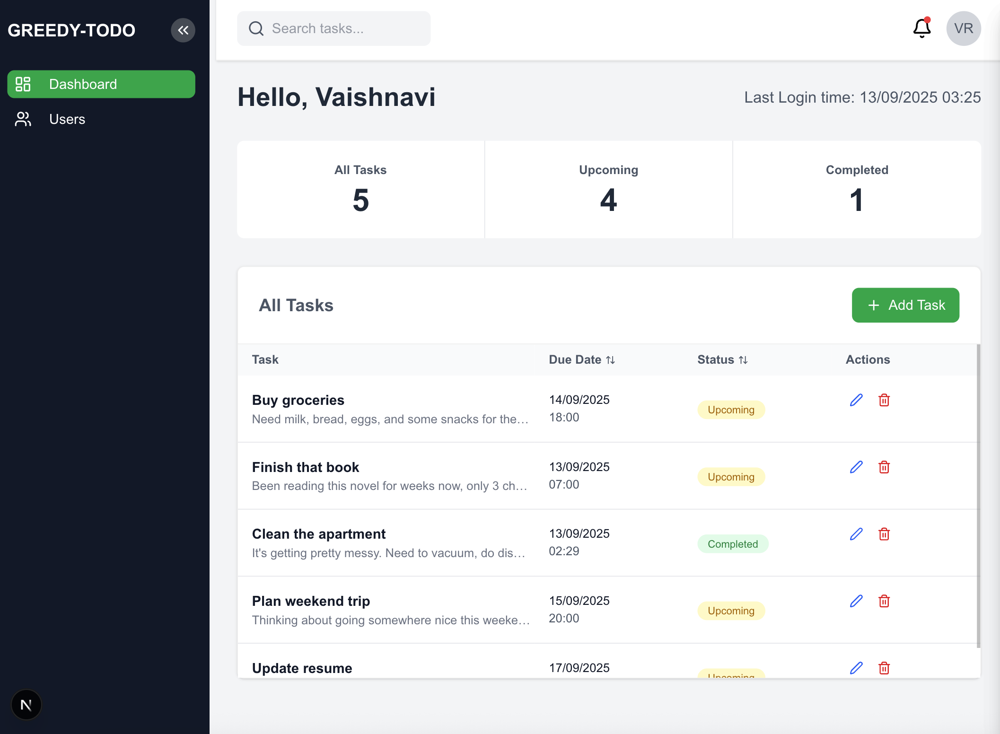
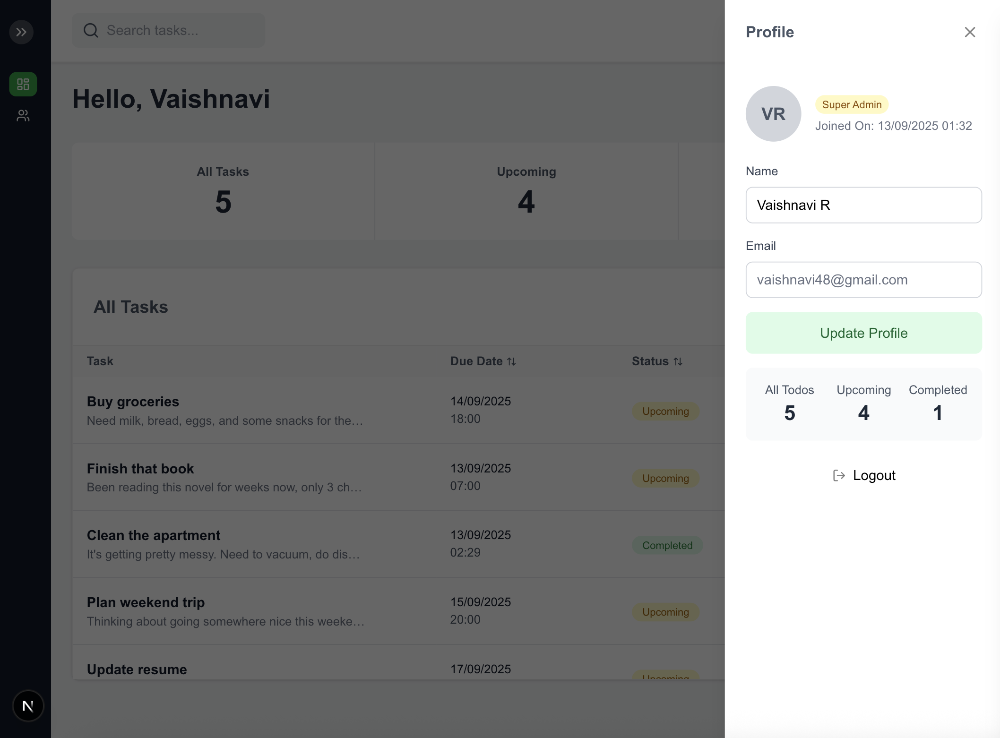
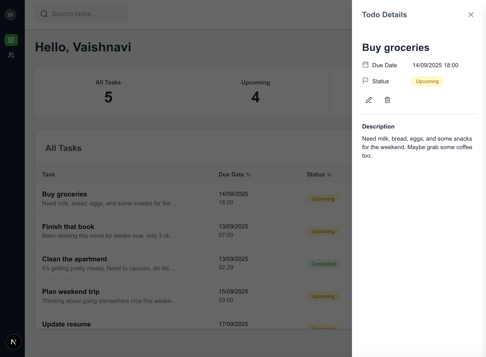
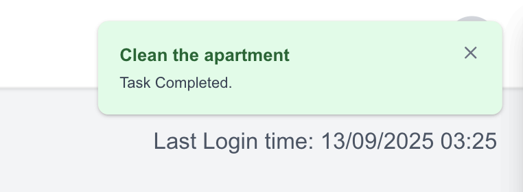

# 🚀 Greedy Todo - My Full-Stack Learning Project

<div align="center">
  
  <p><em>A project I built to level up my full-stack development skills</em></p>
</div>

## Why I Built This

I wanted to dive deeper into full-stack development and learn the technologies I'd been hearing about. This project became my playground for experimenting with real-time features, complex state management, and modern authentication patterns.

## 🚀 Features

✅ **Real-time task management** with live updates  
🔐 **Dual authentication** (Email/Password + Google OAuth)  
👥 **Role-based access control** (Superuser & Normal user)  
🔔 **Smart notifications** (4-hour deadline warnings)  
📱 **Mobile-first responsive design**  
⚡ **WebSocket integration** for instant sync  
🔍 **Advanced search & filtering**  
📊 **Live dashboard** with task statistics  
🎨 **Modern UI** with Tailwind CSS

## 🌐 Live Demo

👉 **[Try Greedy Todo Now](https://greedy-todo-frontend.vercel.app/)** _(Live on Vercel)_

## What I Learned

This project taught me a lot about:

- **Real-time applications** with WebSocket integration
- **Advanced React patterns** and state management
- **Authentication systems** with multiple providers
- **Mobile-first responsive design**
- **TypeScript** for better code quality
- **Modern deployment** and development workflows

## Tech Stack I Explored

**Frontend**: Next.js 15, React 19, TypeScript, Tailwind CSS  
**Backend**: Node.js, Express, MongoDB, Socket.io  
**Authentication**: JWT + Google OAuth  
**Real-time**: WebSocket connections  
**Deployment**: Vercel, Docker, AWS  
**DevOps**: CI/CD, Containerization

## Getting Started (For Learning)

```bash
git clone https://github.com/yourusername/greedy-todo-frontend.git
cd greedy-todo-frontend
npm install

# You'll need the backend running too
echo "NEXT_PUBLIC_API_URL=http://localhost:8000" > .env.local
echo "NEXT_PUBLIC_BACKEND_URL=http://localhost:8000" >> .env.local

npm run dev
```

Visit `http://localhost:3000` (or 3001 if 3000 is busy)

> **Backend**: Check out [greedy-todo-backend](https://github.com/iScreenager/greedy-todo-backend) for the API implementation

## Screenshots

<div align="center">
  
  
  
  
</div>

## Skills I Developed

### WebSocket Integration

Before this project, I'd never worked with real-time connections. Learning to handle:

- Connection states and reconnection logic
- Event-driven architecture
- Preventing duplicate notifications
- Managing multiple concurrent users

This was probably the most challenging part, but also the most rewarding.

### Advanced State Management

I experimented with different approaches to managing state:

- React Context for global state
- Local state for component-specific data
- WebSocket state for real-time updates
- localStorage for persistence

Learning when to use each approach was crucial.

### Authentication & Security

I implemented a dual authentication system to understand:

- JWT token management
- Google OAuth integration
- Role-based access control
- Secure data storage
- Route protection patterns

### Mobile-First Development

Building responsive interfaces taught me:

- CSS Grid and Flexbox patterns
- Mobile-specific interactions
- Adaptive layouts
- Touch-friendly design
- Performance considerations

### TypeScript Integration

This project helped me understand:

- Type definitions and interfaces
- Generic types and utility types
- Type safety in React components
- API response typing
- Error handling with types

## Technical Challenges I Tackled

### Real-Time Notifications

**Problem**: How do you show notifications to users without spamming them or showing duplicates?

**Learning**: I had to understand event filtering, connection management, and state synchronization. The solution involved filtering notifications by ID and implementing proper cleanup.

### Dynamic User Roles

**Problem**: How do you handle role changes that affect the entire UI in real-time?

**Learning**: This taught me about WebSocket events, localStorage synchronization, and dynamic route protection. Users now see role changes instantly across all devices.

### Complex Form Validation

**Problem**: How do you create forms that validate properly and handle edge cases?

**Learning**: I explored React Hook Form with Zod schemas, custom validation logic, and error handling patterns. This was my first deep dive into form libraries.

### Responsive Data Tables

**Problem**: How do you make data tables work on mobile devices?

**Learning**: I had to completely rethink table layouts, implementing adaptive designs that switch between table and card layouts based on screen size.

### Date/Time Handling

**Problem**: How do you properly handle dates and times across different formats and timezones?

**Learning**: I built utility functions for time conversion, date comparisons, and status calculations. This taught me a lot about JavaScript's Date object and timezone handling.

## Architecture Decisions

```
src/
├── app/
│   ├── (protected)/          # Protected routes with auth guards
│   │   ├── dashboard/        # Main dashboard
│   │   └── users/           # User management
│   └── auth/                # Authentication pages
├── components/              # Reusable UI components
├── contexts/                # Global state management
├── hooks/                   # Custom React hooks
├── lib/                     # WebSocket setup
└── types/                   # TypeScript definitions
```

I chose this structure to learn about:

- Next.js App Router patterns
- Component organization
- Custom hook patterns
- TypeScript project structure

## The Backend

I built a separate backend to understand full-stack architecture:

- RESTful API design
- WebSocket server implementation
- Database modeling with MongoDB
- Authentication middleware
- Error handling patterns

🔗 **[Backend Repository](https://github.com/iScreenager/greedy-todo-backend)**

## 🚧 Upcoming Learning Goals

I'm planning to expand this project further to learn more advanced concepts:

### **PWA Implementation**

- **Service Workers** for offline functionality
- **App-like experience** with installable web app
- **Background sync** for task updates when offline
- **Caching strategies** for better performance

### **Push Notifications**

- **Web Push API** integration
- **Real-time notifications** even when app is closed
- **Custom notification handling** for different task types
- **Cross-platform notification** support

### **Dockerization**

- **Containerization** of both frontend and backend
- **Docker Compose** for local development setup
- **Production deployment** with Docker
- **CI/CD pipeline** integration

These additions will help me understand modern web development practices, DevOps workflows, and advanced browser APIs.

## Contributing

This is a learning project, so feel free to:

- Fork it and experiment
- Suggest improvements or different approaches
- Use it as a reference for your own projects
- Point out areas where I could improve

---

<div align="center">
  <p>Built by <strong>Vaishnavi Rastogi</strong> as a learning project</p>
  <p>
    <a href="https://github.com/iScreenager">GitHub</a> •
    <a href="https://linkedin.com/in/vaishnavi-rastogi-104501194">LinkedIn</a> •
    <!-- <a href="https://twitter.com/">Twitter</a> -->
  </p>
</div>
